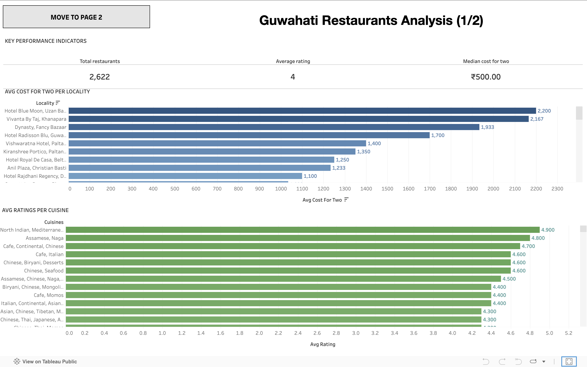
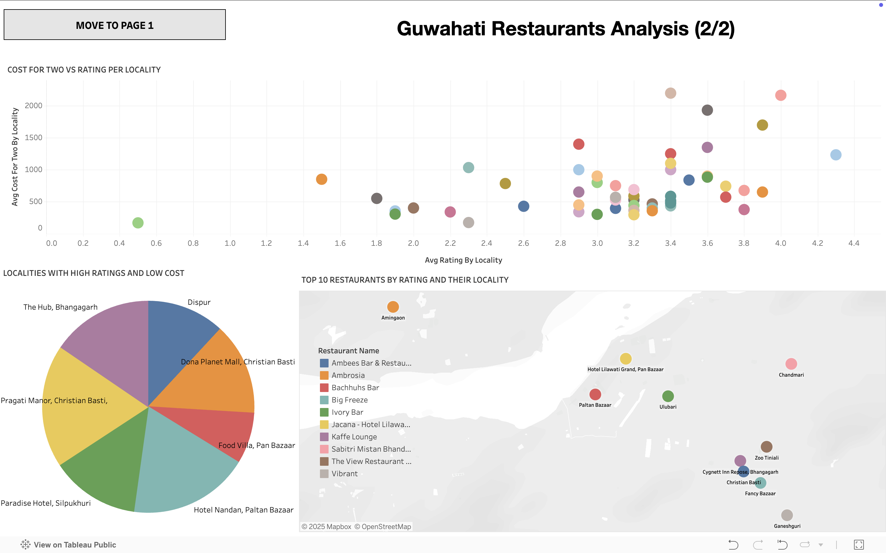

# Guwahati Restaurants Market Analysis (SQL + Tableau)

## Objective
Help an entrepreneur decide whether and where to open a restaurant in Guwahati and how to position it (cuisine, price point, target areas) using exploratory analysis and simple actionable KPIs.

The dataset was collected from Kaggle. The dataset shows Zomato restaurants (all over India) with their ratings, votes, other crucial data to do some research work.
[Link to the dataset](https://www.kaggle.com/datasets/rabhar/zomato-restaurants-in-india)

## Few Queries made using SQL

- <u>Total restaurants in Guwahati</u>

`SELECT COUNT(*) AS total_restros_in_guwahati FROM guwahati_restaurants;`

- <u>Average rating overall</u>

`SELECT FORMAT(SUM(aggregate_rating)/COUNT(*),1) AS avg_overall_rating FROM guwahati_restaurants;`

- <u>Median cost for two</u>

`SELECT FLOOR(COUNT(*)/2) FROM guwahati_restaurants;`
`SELECT average_cost_for_two FROM guwahati_restaurants ORDER BY average_cost_for_two LIMIT 1 OFFSET 363;`

- <u>Average cost for two by locality</u>

`SELECT locality, FORMAT(AVG(average_cost_for_two),2) AS avg_cost_for_two FROM guwahati_restaurants  GROUP BY locality ORDER BY avg_cost_for_two DESC;`

### <u>**[Check out the full SQL file](https://raw.githubusercontent.com/aayushmanmukherjee/RestaurantAnalysis/refs/heads/main/queries.sql)**</u>

## Analysis using Tableau

### <u>**[Check out the Tableau dashboard](https://public.tableau.com/views/ghy_restaurants_dashboard/Dashboard1?:language=en-US&:sid=&:redirect=auth&:display_count=n&:origin=viz_share_link)**</u>

## Conclusion

- The analysis indicates that restaurants in Guwahati generally have an average rating of around 4.0 with a median cost for two of approximately ₹500.00.
- The top performing cuisines by ratings are North Indian, Mediterranean; Assamese, Naga; Cafe, Continental, Chinese.
- Top performing localities are Paradise Hotel, Silpukhuri; Food Villa, Pan Bazaar; Dona Planet Mall, Christian Basti they show a combination of high ratings and moderate costs, suggesting strong customer satisfaction and affordability.
- If someone wants to open a restaurant with premium prices then the best localities are Pragati Manor, Christian Basti; Hotel Nakshatra, Beltola; Hotel Nandan, Paltan Bazaar.

## All the important links
- ### [SQL file link](https://raw.githubusercontent.com/aayushmanmukherjee/RestaurantAnalysis/refs/heads/main/queries.sql)
- ### [Tableau dashboard link](https://public.tableau.com/views/ghy_restaurants_dashboard/Dashboard1?:language=en-US&:sid=&:redirect=auth&:display_count=n&:origin=viz_share_link)
- ### [Jupyter notebook link](https://raw.githubusercontent.com/aayushmanmukherjee/RestaurantAnalysis/refs/heads/main/analysis.ipynb)

